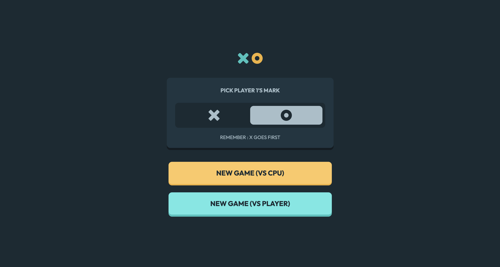

TicTacToe is a dynamic web application built with React, designed to play the classic Tic-Tac-Toe game. It supports two modes: Player vs. Player (PvP) on the same device or Player vs. CPU with a challenging AI opponent. The app features a responsive design optimized for mobile and desktop, with a clean, interactive interface and game state management.

